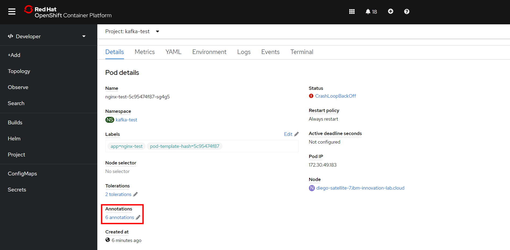

# Ejecución de contenedores como root en RedHat OpenShift

## Introducción:
En esta documentación veremos como ejecutar un contenedor como usuario root, ver los permisos con los que son ejecutados los contenedores además de algunas recomendaciones de seguridad al respecto.

## Advertencia de seguridad:
Ni RedHat ni IBM recomiendan ejecutar contenedores como root, esto se debe a los riesgos de seguridad que esto puede llevar. Si una aplicación que se ejecuta como root es vulnerada, permitiendo al atacante hacer ejecución de código, todas las instrucciones que el atacante envíe serán ejecutadas con los permisos del usuario que ejecuta la aplicación, en este caso root, siendo extremadamente peligroso ya que puede generar desde una filtración de datos hasta dejar inoperativa la aplicación o incluso el sistema entero.

Por esta razón se recomienda hacer aplicaciones que no necesiten permisos de root para ser ejecutadas.<br>
Si su aplicación necesita permisos de root para ser ejecutada, se recomienda modificar la aplicación para que no sea necesario ejecutarla con permisos de root.
En el caso que su aplicación no pueda ser adaptada para ser ejecutada sin permisos de root continúe leyendo esta documentación.

---

## Ver permisos de ejecución del contenedor:
Para conocer los permisos de ejecución del contenedor se debe saber el Security Context (SCC) que posee, este dato se muestra en los _Annotations_ de los pods de la aplicación.<br>
Esto lo podemos conocer a través de la consola web o desde el cli.

### Consola web:
Para acceder a los _Annotations_ de un pod desde la consola web se debe acceder a los detalles del mismo, estando en esta pantalla encontraremos los _Annotations_ donde lo indica la imagen.



Haciendo click en el link indicado en la imagen anterior se desplegará una pantalla que permite ver y editar los _Annotations_, nosotros solamente nos concentraremos en el que muestra la imagen.


Como muestra la imagen, vemos que tenemos un _Annotation_ con una key _openshift.io/scc_, el value de esta key nos indica los permisos que tiene el contenedor. <br>
Si el value es _restricted_ el contenedor no tiene permisos de ejecución root.<br>
De lo contrario si el value es _anyuid_ o _privileged_ el contenedor si tiene permisos de ejecución de root.


### CLI:
Para acceder a los _Annotations_ de un pod desde la cli se debe describir el pod, teniendo el nombre del pod que nos interesa describir escribimos el comando ```oc describe pod {nombre_pod}``` como indica la imagen.


Este comando nos muestra toda la información relacionada con el pod, dentro de esos datos se encuentran los _Annotations_ y dentro de estos podremos encontrar una key _openshift.io/scc_ que nos indica los permisos de ejecución.<br>
Si el value es _restricted_ el contenedor no tiene permisos de ejecución root.<br>
De lo contrario si el value es _anyuid_ el contenedor si tiene permisos de ejecución de root.


---

## Permisos root dentro de OpenShift:

Dentro de OpenShift tenemos varias maneras de poder ejecutar un contenedor con permisos de root, en esta documentación veremos dos maneras: Ejecutando el contenedor dentro del project Default o trabajando con distintos projects.

> Nota: En los ejemplos mostrados en esta documentación se utilizó una imagen de Nginx para crear el despliegue, esto porque dicha imagen necesita permisos root para poder desplegar el contenedor correctamente.

### Project Default:
OpenShift permite ejecutar contenedores con permisos root dentro del project Default sin tener que hacer ninguna configuración.<br>
Para hacer la prueba usaremos el siguiente yaml para hacer un deployment de un único contenedor con nginx.
```
apiVersion: apps/v1
kind: Deployment
metadata:
  name: nginx-test
  namespace: default
  labels:
     app: nginx-test
spec:
  replicas: 1 
  selector:
    matchLabels:
      app: nginx-test
  template:
    metadata:
      labels:
        app: nginx-test
    spec:
      containers:
      - name: nginx-test
        image: nginx:1.21.6
        ports:
        - containerPort: 80
```
Haciendo el despliegue de este yaml sobre el project Default podemos ver como el despliegue se realiza exitosamente y el pod llega al estado _Running_.<br>


>Nota: Los despliegues hechos en el project _Default_ no poseen el _Annotation_ que indica el SCC

<br>

### Utilizando otro Project:
Si probamos desplegar el mismo yaml que desplegamos en el project Default pero esta vez sobre un project distinto (ej: root-test) podremos ver como esta vez el pod no llega al estado _Running_ y queda en un loop de crashear y reiniciarse.

```
apiVersion: apps/v1
kind: Deployment
metadata:
  name: nginx-test
  namespace: root-test
  labels:
     app: nginx-test
spec:
  replicas: 1 
  selector:
    matchLabels:
      app: nginx-test
  template:
    metadata:
      labels:
        app: nginx-test
    spec:
      containers:
      - name: nginx-test
        image: nginx:1.21.6
        ports:
        - containerPort: 80
```


Esto se debe a la configuración que realiza OpenShift al crear un nuevo project. Cuando se genera un project, asociado a este son creados Service Accounts (SA), estos representan al usuario que ejecuta nuestros contenedores y como todo usuarios estos también tienen permisos correspondientes. Estos permisos los controla el SCC que esté asignado al SA que estemos utilizando.<br>

OpenShift al realizar un despliegue donde no se especifica un SA a ser utilizado, realiza el despliegue usando el SA _default_ de nuestro project. Este SA tiene asignado el SCC _restricted_ que no permite ejecutar aplicaciones como root y por ende generando que nuestro pod no se pueda desplegar correctamente.<br>
Una solución sencilla podría ser asignar el SCC _anyuid_ al SA _default_, pero esto es un riesgo de seguridad ya que cualquier despliegue que se haga en el project va a estar siendo ejecutado con permisos root, dejando la posibilidad de que una de las aplicaciones sea vulnerada y se puedan filtrar datos o llegar a dejar en sistema inoperable.<br>

Por esta razón recomendamos crear un nuevo SA para utilizarlo solamente en los despliegues que necesiten ser ejecutados con permisos root, así minimizando el riesgo.<br>

Para esto ejecutamos el comando ```oc create serviceaccount {Nombre_ServiceAccount} -n {Nombre_Project}``` en el cli remplazando _Nombre_ServiceAccount_ con el nombre que se le quiera asignar al SA y _Nombre_Project_ con el nombre del project en el que estemos trabajando. En el ejemplo el SA se llama _permisos-root_ y el project _root-test_.


Teniendo el SA creado tenemos que asignarle el SCC _anyuid_ para tener permisos root y poder desplegar correctamente la aplicación. Para esto usaremos el comando ```oc adm policy add-scc-to-user anyuid system:serviceaccount:{Nombre_Project}:{Nombre_ServiceAccount}``` remplazando _Nombre_Project_ y _Nombre_ServiceAccount_ con sus respectivos valores.


Ahora que nuestro SA tiene permisos root solo nos queda hacer el despliegue de nginx pero especificando el SA a ser utilizado. Esto lo realizamos agregando _serviceAccountName_ a las especificaciones de nuestro pod dentro del yaml quedando como el siguiente ejemplo.

```
apiVersion: apps/v1
kind: Deployment
metadata:
  name: nginx-test
  namespace: root-test
  labels:
     app: nginx-test
spec:
  replicas: 1 
  selector:
    matchLabels:
      app: nginx-test
  template:
    metadata:
      labels:
        app: nginx-test
    spec:
      serviceAccountName: permisos-root
      containers:
      - name: nginx-test
        image: nginx:1.21.6
        ports:
        - containerPort: 80
```

Ahora si hacemos el despliegue el contenedor de nginx llega al estado _Running_ demostrando que hemos hecho todo de manera correcta.


